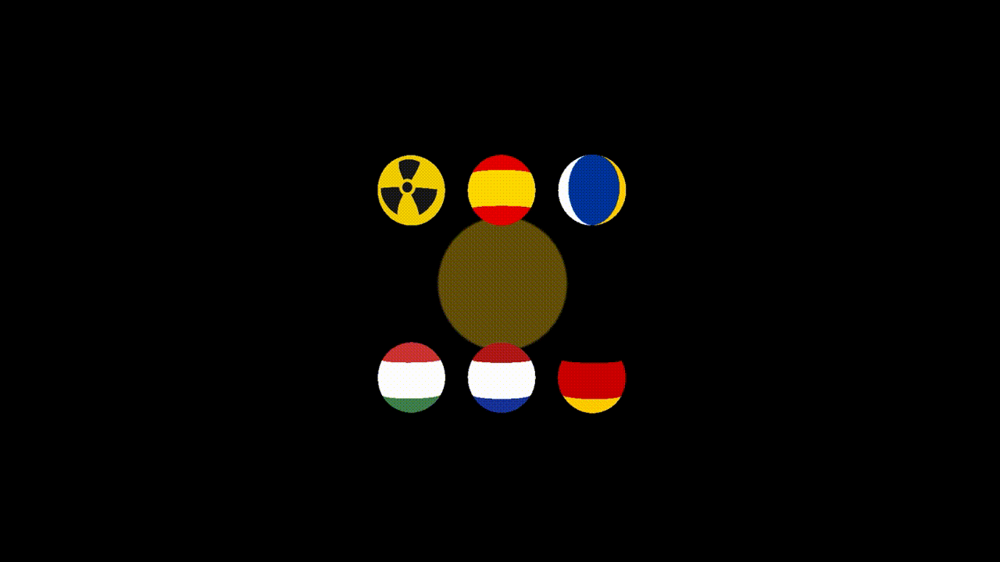

# Práctica semana 9/10 - _Fragment Shader_

**Autor:** Alejandro de Olózaga Ramírez

**Fecha:** 19 de Noviembre del 2025

## Descripción
En esta práctica, se propone un dibujado con el _Fragment Shader_ en [Codesandbox](https://codesandbox.io/p/sandbox/ig2526-s9-forked-ksdz6t) para interactuar y practicar con las posibilidades de diseño o dibujado del recurso. Lo que se presenta es un fondo animado frente a 6 esferas cada una con una textura distinta: una con símbolo de radiación y las otras 5 con banderas de países.

A continuación, se adjunta una animación en formato GIF.



También se incluye una versión en _tiny code_ de los dos _Fragment Shader_ (el fondo animado y el símbolo de radiación). No se incluyen las banderas debido a su simplicidad:
- [Fondo animado](resources/background.js)
- [Símbolo radiación](resources/radiationSymbol.js)

## _Fragment Shader_
El _Fragment Shader_ (o shader de fragmentos) es el trozo de código que se ejecuta para cada píxel de cada fragmento con el objetivo de calcular y rellenar el color en cada píxel. En este caso, se interactúa directamente con este código para pintar a conciencia un plano, que actúa como fondo, y esferas, que se sitúan delante del plano.

En el código, se crean varias funciones (7 en total) y cada una posee un código distinto, actuando así como un _Fragment Shader_ diferente para cada objeto al que se le aplique.

### Definiciones generales
Hay algunas definiciones y parámetros generales que se han incluido en cada _Fragment Shader_ creado.

El siguiente bloque de definición, fuerza el uso de precisión media para decimales en dispositivos móviles y navegadores.
```js
#ifdef GL_ES
precision mediump float;
#endif
```

Aparte, se declaran los siguientes _uniform_, que son las variables globales provenientes de la CPU. Se determina el tamaño de la ventana (exclusivamente para el fondo), la posición del ratón y el tiempo transcurrido.
```js
uniform vec2 u_resolution;
uniform vec2 u_mouse;
uniform float u_time;
```
Con las variables anteriores, se consigue atribuir un color distinto al fondo dependiendo del tiempo y de la posición del ratón.

Por último, se normalizan las coordenadas de (-1, -1) a (1, 1) con la siguiente línea, convirtiendo el punto (0, 0) en el centro de la imagen.
``vec2 st = vUv * 2.0 - 1.0;``

### Fondo animado
El _Fragment Shader_ retornado por la función ``backgroundFragmentShader()`` se aplica sobre un plano y actúa de fondo. La textura que se consigue es un círculo que se despieza en 8 partes que se dispersan una distancia dada por la variable ``float max_separation``. Todas las piezas llegan a formar una figura con un centro vacío en forma de círculo. Finalmente, cada pieza vuelve a su posición original formando de nuevo la figura inicial.

Para controlar el movimiento de las piezas, se declaran, entre otras, las siguientes variables para controlar los siguientes aspectos:
- Tiempo que tarda en irse cada pieza: ``float move_duration``.
- Retraso entre cada pieza para conseguir un efecto de ola: ``float stagger_delay``.
- Tiempo de pausa cuando el círculo está completamente despiezado: ``float hold_time``.
- Tiempo de pausa cuando el círculo está completo: ``float pause_closed``.

La variable ``total_open_sequence`` indica el tiempo que transucrre entre el inicio del movimiento de la primera pieza hasta el final del movimiento de la última. La variable ``total_cycle`` indica el tiempo total que transcurre en la animación, teniendo en cuenta las paradas al inicio y al final. Además, se consigue un bucle de tiempo gracias a ``float t``, ya que se utiliza el módulo entre ``u_time`` y ``total_cycle`` para que, cuando la animación llegue al final, empiece de nuevo desde 0.

Por último, el color de la figura dependerá de la posición del ratón en la ventana y el tiempo transcurrido:
``vec3 final_color = vec3(u_mouse.x, u_mouse.y, abs(sin(u_time))) * circle``;

Se destaca el uso de la función ``smoothstep`` que logra un suavizado (_antialiasing_), no como el ``step`` normal.

### Símbolo de radiación
El _Fragment Shader_ retornado por la función ``radiationSymbolFragmentShader()`` se aplica sobre una esfera. Básicamente, la función genera el símbolo de peligro radioactivo cuyas aspas giran consecusivamente sobre el centro. 

Para aplicar la rotación contando con el ángulo, primero se calcula este (``float a = atan(st.y, st.x)``) y luego se le aplica la animación de rotación moviéndolo (``a += u_time * 0.5``). Luego, las aspas que conforman el símbolo están separadas por 120º (``float sector = 2.0 * PI / 3.0``). En este caso, no se dibujan las 3 aspas, sino que se dibuja 1 que se repite cada 120º. Finalmente, se pinta de color amarillo el fondo y el símbolo de negro.

### Banderas de países
Para las banderas de los países, simplemente, se calculan los puntos que se encuentran en un rango para pintarlos de un color determinado. Por ejemplo, en la bandera de España, los puntos del eje Y (``vUv.y``) que estén en el primer tercio (``st.y < 0.33``), se pintan de rojo.

Para las banderas con franjas horizontales, como la de Canarias, se usa la coordenada X en vez de la Y (``st.x < 0.33``). No obstante, también existe la opción de pintar el objeto por franjas verticales, para que se pinten anillos, y luego girarlo para dar sensación de franjas verticales.

### Motivación
Los _Fragment Shader_ desarrollados han surgido de los ejemplos mostrados en el github con los guiones de prácticas propuestos y los ejemplos mostrados en [_The Book of Shaders_](https://thebookofshaders.com/?lan=es). Inicialmente, se planteaba únicamente el fondo animado, pero, cuando se finalizó, surgió la idea de crear símbolos de peligro. 

No obstante, como algunos parecían bastante avanzados, se optó por algo más simple: añadir banderas de países. De esta manera, la propuesta consta de, en última instancia, tres propuestas diferentes. 

## Tecnologías
Las tecnologías y librerías usadas son las siguientes:
- HTML5 y CSS3: estructura base.
- JavaScript: lenguaje de programación, base del proyecto.
- Three.js (v0.152.1): motor 3D para la creación de la escena, cámara (control orbital), geometrías y textura.


## Uso de IA
La Inteligencia artificial se ha usado para planteamiento de dudas con respecto al _Fragment Shader_ y su desarrollo. Principalmente, ha servido para llevar las ideas al código y obtener como resultado la textura que se ha generado para el fondo y la del símbolo de radiación. Por último, también se ha utilizado para pasar el código a tinyCode.