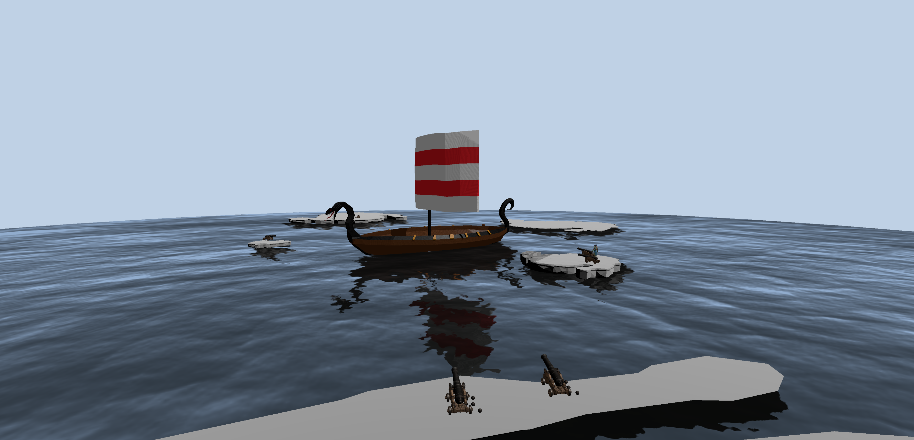

# Práctica semana 11 - Animación

**Autor:** Alejandro de Olózaga Ramírez

**Fecha:** 29 de Noviembre del 2025

**Demo:** [Codesandbox](https://codesandbox.io/p/sandbox/ig-semana-11-lq5vdp) | [Youtube](https://youtu.be/hXEyirP-O9Q)

## Descripción
En esta práctica, se propone una animación con físicas en Codesanbox para una ligera introducción en el motor de físicas ``ammo.js`` con renderizado 3D (``Three.js``). La escena representa un entorno marítimo donde se encuentra un modelo 3D de un barco, de unas islas y de cañones apuntando al barco pudiendo accionar su disparo. 

El objetivo principal es sincronizar una representación gráfica visual (modelos 3D) con un mundo físico invisible, manejando la carga de modelos y la interacción del usuario. A continuación, se presenta una imagen de referencia:

Para este proyecto, se ha querido implementar la detección de colisiones entre balas y el barco y la destrucción de este último. Debido a su complejidad, por tratarse de un modelo 3D, no se ha integrado. Sin embargo, el proyecto queda abierto para futuras ampliaciones.

## Funcionalidades
El proyecto integra unas funcionalidades visuales y físicas básicas gracias a la inclusión de las tecnologías mencionadas más adelante. Se destacan las siguientes:
- Carga de modelos 3D: se usa el ``GLTFLoader`` para cargar modelos 3D (barco, isla, cañón y personaje), haciendo uso de sombras.
- Simulación física: creación de cuerpos rígidos para proyectiles y contenedores invisibles (_hitbox_).
- Disparo de cañones: bola generada en la posición de cada cañón cargado con un efecto de destello (_muzzle flash_) en cada disparo.
- Agua animada: se usa el componente ``Water`` para lograr un movimiento continuo de la superficie del agua y conseguir más realismo.
- Control de cámara: posibilidad de rotación de cámara y zoom de la escena.

## Controles
Los controles son básicos, ya que no hay muchas acciones que se puedan realizar. Estos se muestran en la siguiente tabla:

| Acción  | Tecla  |
|---|---|
|  Disparar | Clic izquierdo  |
|  Rotar cámara | Arrastrar el ratón (manteniendo pulsado)  |
|  Hacer zoom | _Scroll_  |

## Tecnologías
Las tecnologías y librerías usadas son las siguientes:
- HTML5 y CSS3: estructura base.
- JavaScript: lenguaje de programación, base del proyecto.
- Three.js (v0.152.1): motor 3D para la creación de la escena, cámara (control orbital), geometrías y textura.
- TWEEN.js (v18.6.4): biblioteca para creación de animaciones suaves.
- Ammo.js (v1.0.2): motor de físicas para simulación de colisiones y cuerpos rígidos 3D.

## Modelos
- [Modelo del barco](https://www.fab.com/listings/48fbc75b-1b87-4a6e-bd62-8fb397571d49)
- [Modelo de la isla](https://sketchfab.com/3d-models/low-poly-island-4130717317004312998c4825fb683093#download)
- [Modelo de almirante pirata](https://www.cgtrader.com/items/6091558/download-page)
- Modelo de los cañones

## Uso de IA
La Inteligencia artificial se ha usado para dudas puntuales en el desarrollo del proyecto y resolución de errores, sobre todo, con respecto a la carga de modelos 3D. Como en los anteriores proyectos, generalmente, ha servido para llevar la idea de entorno marítimo al código. También se le ha preguntado sobre la posible ampliación de destrucción del barco.

